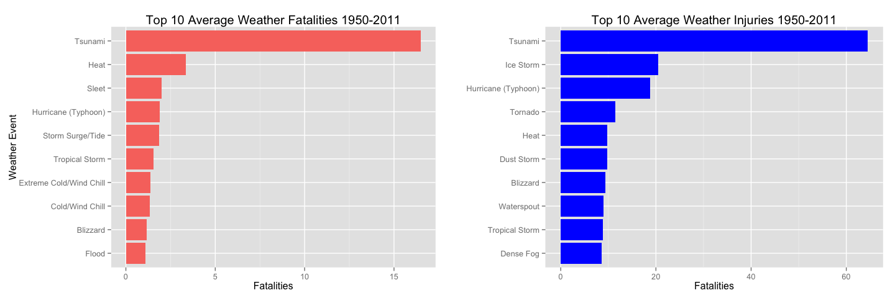
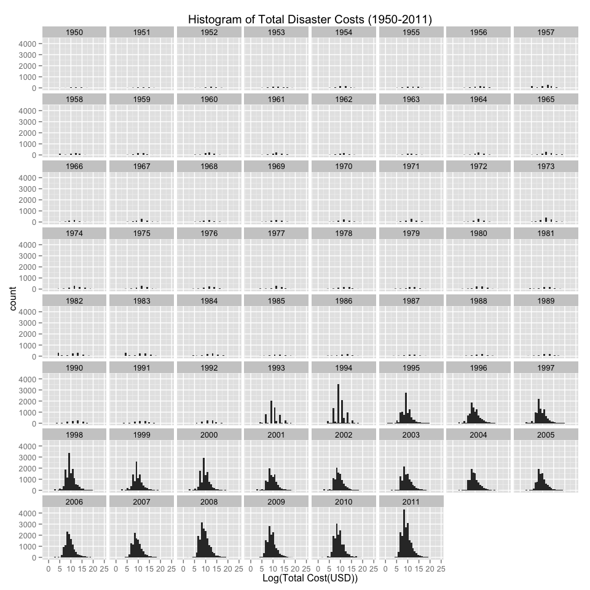
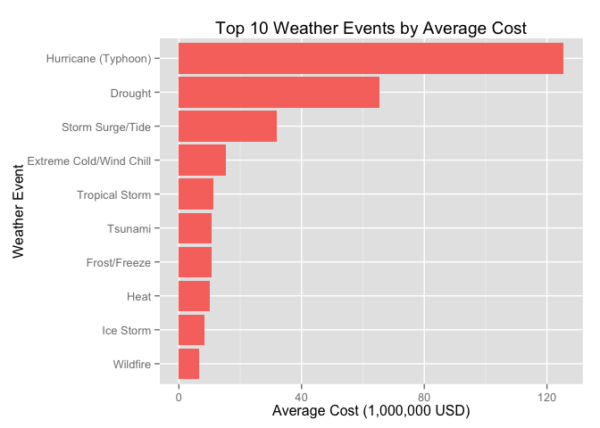

# Human and Economic Impact of Weather Events in United States 1950 - 2011
Chris O'Brien  
13 June 2015  

## Synopsis

In this report we aim to determine weather events in the United States that are most harmful to population health and have the greatest economic impact. This is an exploratory analysis into the U.S. National Oceanic and Atmospheric Administration's (NOAA) storm database. The database contains records of weather events in the United States from 1950 to 2011 including injuries, fatalities, property and crop damage costs.

Using all the data present in the database over that time we found that the Tsunamis represent the event with the greatest human impact to the United States. Hurricanes are the event that have the greatest economic consequences.

Further analysis could go into a state by state analysis of the impact for a more regional recommendation on events municipal and government officials should plan for.

## Data Processing

### Required Libraries

For this analysis there are a few libraries that we require to manipulate, clean and plot our data


```r
library(data.table)
library(dplyr)
library(tidyr)
library(ggplot2)
source("http://peterhaschke.com/Code/multiplot.R")
```

### Loading the data

From the  U.S. National Oceanic and Atmospheric Administration's (NOAA) we obtained storm data from across the United States from 1950 to November 2011. 

The data has been made available to us from our Coursera site. The data is a compressed bz2 file comprising a comma separated file of the Storm data from the years in question. 


```r
download.file('https://d396qusza40orc.cloudfront.net/repdata%2Fdata%2FStormData.csv.bz2', 
              destfile = 'StormData.csv.bz2', method = 'curl')
weatherData <- data.table(read.csv('StormData.csv.bz2'))
dim(weatherData)
```

```
## [1] 902297     37
```

As you can see we have 902,297 separate events ranging from 1950 to 2011. 


```r
str(weatherData)
```

```
## Classes 'data.table' and 'data.frame':	902297 obs. of  37 variables:
##  $ STATE__   : num  1 1 1 1 1 1 1 1 1 1 ...
##  $ BGN_DATE  : Factor w/ 16335 levels "1/1/1966 0:00:00",..: 6523 6523 4242 11116 2224 2224 2260 383 3980 3980 ...
##  $ BGN_TIME  : Factor w/ 3608 levels "00:00:00 AM",..: 272 287 2705 1683 2584 3186 242 1683 3186 3186 ...
##  $ TIME_ZONE : Factor w/ 22 levels "ADT","AKS","AST",..: 7 7 7 7 7 7 7 7 7 7 ...
##  $ COUNTY    : num  97 3 57 89 43 77 9 123 125 57 ...
##  $ COUNTYNAME: Factor w/ 29601 levels "","5NM E OF MACKINAC BRIDGE TO PRESQUE ISLE LT MI",..: 13513 1873 4598 10592 4372 10094 1973 23873 24418 4598 ...
##  $ STATE     : Factor w/ 72 levels "AK","AL","AM",..: 2 2 2 2 2 2 2 2 2 2 ...
##  $ EVTYPE    : Factor w/ 985 levels "   HIGH SURF ADVISORY",..: 834 834 834 834 834 834 834 834 834 834 ...
##  $ BGN_RANGE : num  0 0 0 0 0 0 0 0 0 0 ...
##  $ BGN_AZI   : Factor w/ 35 levels "","  N"," NW",..: 1 1 1 1 1 1 1 1 1 1 ...
##  $ BGN_LOCATI: Factor w/ 54429 levels ""," Christiansburg",..: 1 1 1 1 1 1 1 1 1 1 ...
##  $ END_DATE  : Factor w/ 6663 levels "","1/1/1993 0:00:00",..: 1 1 1 1 1 1 1 1 1 1 ...
##  $ END_TIME  : Factor w/ 3647 levels ""," 0900CST",..: 1 1 1 1 1 1 1 1 1 1 ...
##  $ COUNTY_END: num  0 0 0 0 0 0 0 0 0 0 ...
##  $ COUNTYENDN: logi  NA NA NA NA NA NA ...
##  $ END_RANGE : num  0 0 0 0 0 0 0 0 0 0 ...
##  $ END_AZI   : Factor w/ 24 levels "","E","ENE","ESE",..: 1 1 1 1 1 1 1 1 1 1 ...
##  $ END_LOCATI: Factor w/ 34506 levels ""," CANTON"," TULIA",..: 1 1 1 1 1 1 1 1 1 1 ...
##  $ LENGTH    : num  14 2 0.1 0 0 1.5 1.5 0 3.3 2.3 ...
##  $ WIDTH     : num  100 150 123 100 150 177 33 33 100 100 ...
##  $ F         : int  3 2 2 2 2 2 2 1 3 3 ...
##  $ MAG       : num  0 0 0 0 0 0 0 0 0 0 ...
##  $ FATALITIES: num  0 0 0 0 0 0 0 0 1 0 ...
##  $ INJURIES  : num  15 0 2 2 2 6 1 0 14 0 ...
##  $ PROPDMG   : num  25 2.5 25 2.5 2.5 2.5 2.5 2.5 25 25 ...
##  $ PROPDMGEXP: Factor w/ 19 levels "","-","?","+",..: 17 17 17 17 17 17 17 17 17 17 ...
##  $ CROPDMG   : num  0 0 0 0 0 0 0 0 0 0 ...
##  $ CROPDMGEXP: Factor w/ 9 levels "","?","0","2",..: 1 1 1 1 1 1 1 1 1 1 ...
##  $ WFO       : Factor w/ 542 levels ""," CI","%SD",..: 1 1 1 1 1 1 1 1 1 1 ...
##  $ STATEOFFIC: Factor w/ 250 levels "","ALABAMA, Central",..: 1 1 1 1 1 1 1 1 1 1 ...
##  $ ZONENAMES : Factor w/ 25112 levels "","                                                                                                                               "| __truncated__,..: 1 1 1 1 1 1 1 1 1 1 ...
##  $ LATITUDE  : num  3040 3042 3340 3458 3412 ...
##  $ LONGITUDE : num  8812 8755 8742 8626 8642 ...
##  $ LATITUDE_E: num  3051 0 0 0 0 ...
##  $ LONGITUDE_: num  8806 0 0 0 0 ...
##  $ REMARKS   : Factor w/ 436781 levels "","\t","\t\t",..: 1 1 1 1 1 1 1 1 1 1 ...
##  $ REFNUM    : num  1 2 3 4 5 6 7 8 9 10 ...
##  - attr(*, ".internal.selfref")=<externalptr>
```

### Cleaning the Data 

#### Parsing EVTYPE

So we are attempting to answer two questions based on the type of event from the data. As it turns out we have over over 985 unique event types over that time range however many names do not describe an event and require some cleaning to bring them in line with the permitted storm events described in the [National Climatic Data Center Storm Events FAQ][1] 


```r
length(levels(weatherData$EVTYPE))
```

```
## [1] 985
```

As we are setting out to answer two sets of questions, those events that have the greatest impact to human life and those with the greatest economic consequences. So rather than clean all the fields which would require a significant time investment we are going to see if we can filter for data relevant to our analysis.

Taking the weather data we filter where we have any human impact (a Fatality or Injury greater than 0) or economic impact (Property Damage or Crop Damage greater than 0)


```r
relevant_events <- weatherData %>% filter(FATALITIES > 0 | INJURIES > 0 | PROPDMG > 0 | CROPDMG > 0) 
dim(relevant_events)
```

```
## [1] 254633     37
```

This has narrowed down our dataset to 254,633 weather events


```r
relevant_events %>% 
    group_by(EVTYPE) %>% 
    summarise(count=n()) %>% 
    arrange(desc(count))
```

```
## Source: local data table [488 x 2]
## 
##                EVTYPE count
## 1           TSTM WIND 63234
## 2   THUNDERSTORM WIND 43655
## 3             TORNADO 39944
## 4                HAIL 26130
## 5         FLASH FLOOD 20967
## 6           LIGHTNING 13293
## 7  THUNDERSTORM WINDS 12086
## 8               FLOOD 10175
## 9           HIGH WIND  5522
## 10        STRONG WIND  3370
## ..                ...   ...
```

It has also lowered the amount of EVTYPES to 488. So to perform the cleaning we have taken the list of NOAA event types defined in the [FAQ (Page 6)][1] and saved it into a file called StormDataEventTypes


```r
readLines('StormDataEventTypes')
```

```
##  [1] "Astronomical Low Tide Z"    "Avalanche Z"               
##  [3] "Blizzard Z"                 "Coastal Flood Z"           
##  [5] "Cold/Wind Chill Z"          "Debris Flow C"             
##  [7] "Dense Fog Z"                "Dense Smoke Z"             
##  [9] "Drought Z"                  "Dust Devil C"              
## [11] "Dust Storm Z"               "Excessive Heat Z"          
## [13] "Extreme Cold/Wind Chill Z"  "Flash Flood C"             
## [15] "Flood C"                    "Frost/Freeze Z"            
## [17] "Funnel Cloud C"             "Freezing Fog Z"            
## [19] "Hail C"                     "Heat Z"                    
## [21] "Heavy Rain C"               "Heavy Snow Z"              
## [23] "High Surf Z"                "High Wind Z"               
## [25] "Hurricane (Typhoon) Z"      "Ice Storm Z"               
## [27] "Lake-Effect Snow Z"         "Lakeshore Flood Z"         
## [29] "Lightning C"                "Marine Hail M"             
## [31] "Marine High Wind M"         "Marine Strong Wind M"      
## [33] "Marine Thunderstorm Wind M" "Rip Current Z"             
## [35] "Seiche Z"                   "Sleet Z"                   
## [37] "Storm Surge/Tide Z"         "Strong Wind Z"             
## [39] "Thunderstorm Wind C"        "Tornado C"                 
## [41] "Tropical Depression Z"      "Tropical Storm Z"          
## [43] "Tsunami Z"                  "Volcanic Ash Z"            
## [45] "Waterspout M"               "Wildfire Z"                
## [47] "Winter Storm Z"             "Winter Weather Z"
```

Using each of the category names we build a regular expression to match against the EVTYPE. To do this we remove the category from the end of the name (Eg. 'Drought Z' becomes 'Drought') then use this to create a look-forward regular expression ('Drought' becomes '(?=.*Drought)'). This will become the basis of processing of the EVTYPE field.


```r
build_event_to_pattern_map <- function (eventTypeFile){
    eventTypeValues <- readLines(eventTypeFile)
    eventType <- list()
    for (event in eventTypeValues){
        spaceSplit <- strsplit(event, ' ')[[1]]
        lastElement <- length(spaceSplit)
        eventName <- paste(spaceSplit[-lastElement], collapse = ' ')
        typeSplit <- strsplit(eventName, '/')[[1]]
        regexpV <- vector('character', length = length(typeSplit))
        for( i in seq_along(typeSplit) ){
            if(i == 1){
                regexpV[i] <- paste('(?=.*', typeSplit[i], '){1}', sep = '')
            } else {
                regexpV[i] <- paste('(?=.*', typeSplit[i], '){0,1}', sep = '')
            }
        }
        if(grepl('Hurricane', eventName)){
            regexpV <- c('(?=.*Hurricane)|(?=.*Typhoon)')
        }
        eventType[[eventName]] <- paste(regexpV, collapse ='')
    }
    eventType
}

event_map <- build_event_to_pattern_map('StormDataEventTypes')
```

Using this map of Storm Data Event to its regular expression pattern match we default the ProcessedEventType to 'Other' then loop over pattern and find which EVTYPE matches each event. 


```r
apply_event_map <- function (df, eventMap) {
    df$ProcessedEventType <- 'Other'
    for (i in seq_along(eventMap)) {
        eventName <- names(eventMap[i])
        eventMatch <- eventMap[[eventName]]
        indexMatch <- grep(eventMatch,df$EVTYPE, ignore.case=T, perl=T)
        df[indexMatch,]$ProcessedEventType <- eventName
    }
    df
}

relevant_events <- apply_event_map(relevant_events, event_map)
```

So we can see from below that we have 65,833 events left as unknown. Most of these beloning to the TSTM WIND category


```r
dim(relevant_events %>% filter(ProcessedEventType=='Other'))
```

```
## [1] 65833    38
```

```r
relevant_events %>% 
    filter(ProcessedEventType=='Other') %>% 
    group_by(EVTYPE) %>% summarise(total=n()) %>% 
    arrange(desc(total))
```

```
## Source: local data table [207 x 2]
## 
##                  EVTYPE total
## 1             TSTM WIND 63234
## 2  URBAN/SML STREAM FLD   702
## 3      WILD/FOREST FIRE   388
## 4             LANDSLIDE   193
## 5            LIGHT SNOW   119
## 6      MARINE TSTM WIND   109
## 7                   FOG   107
## 8                  WIND    83
## 9        DRY MICROBURST    78
## 10                 SNOW    52
## ..                  ...   ...
```

Lets clean up the final ones that can unambiguously be assigned to one of our known groups. Most will explain themselves except for 'URBAN/SML STREAM FLD' which according to the National Climatic Data Center Storm Events FAQ (page 44) 

*Heavy rain situations, resulting in urban and/or small stream flooding, should be classified as a Heavy Rain*

So we classify these as 'Heavy Rain'


```r
relevant_events[relevant_events[,grepl('^TSTM',EVTYPE, perl=TRUE)],]$ProcessedEventType <- 'Thunderstorm Wind'
relevant_events[relevant_events[,grepl('^THUNDER',EVTYPE, perl=TRUE)],]$ProcessedEventType <- 'Thunderstorm Wind'
relevant_events[relevant_events[,EVTYPE=='WILD/FOREST FIRE'],]$ProcessedEventType <- 'Wildfire'
relevant_events[relevant_events[,EVTYPE=='FOG'],]$ProcessedEventType <- 'Dense Fog'
relevant_events[relevant_events[,EVTYPE=='HEAVY SURF'],]$ProcessedEventType <- 'High Surf'
relevant_events[relevant_events[,EVTYPE=='URBAN/SML STREAM FLD'],]$ProcessedEventType <- 'Heavy Rain'
dim(relevant_events %>% filter(ProcessedEventType=='Other'))
```

```
## [1] 1268   38
```

This leaves us with 1,268 events (0.5% of our total dataset) that we cannot not ascribe to a specific NOAA event type without a significant investment into the Remarks of the document. For the purpose of this analysis we shall leave those as 'Other' and comment around them should they turn out to have a specific impact.

#### Parsing Event Date

While we are aiming to answer those weather events with the greatest human and economic impact, it's likely that these have changed year on year so it's going to be worth knowing the year of the event


```r
relevant_events <- relevant_events %>% 
    mutate(event_year=year(strptime(BGN_DATE, '%m/%d/%Y %H:%M:%S')))
```

We have applied all the generic filtering and processing that we wish to perform on the data so taking our data we seperate it out into our *human_impact_events* and *economic_impact_events*. This is for our final data cleaning task; applying the damage cost modifier to the property and crop damage values


```r
human_impact_events <- relevant_events %>%
    filter(FATALITIES > 0|INJURIES > 0)
economic_impact_events <- relevant_events %>%
    filter(PROPDMG > 0 | CROPDMG > 0)
```

#### Apply Damage Costs Modifier

Before we can perform any economic calculations we need to apply the PROPDMGEXP/CROPDMGEXP to the PROPDMG and CROPDMG respectively.


```r
economic_impact_events %>% 
    filter(PROPDMG > 0) %>% 
    group_by(PROPDMGEXP) %>% 
    summarise(count=n())
```

```
## Source: local data table [16 x 2]
## 
##    PROPDMGEXP  count
## 1           K 227481
## 2           M  11319
## 3           B     40
## 4           m      7
## 5           +      5
## 6           0    209
## 7                 76
## 8           5     18
## 9           6      3
## 10          4      4
## 11          h      1
## 12          2      1
## 13          7      2
## 14          3      1
## 15          H      6
## 16          -      1
```

```r
economic_impact_events %>% 
    filter(CROPDMG > 0) %>% 
    group_by(CROPDMGEXP) %>% 
    summarise(count=n())
```

```
## Source: local data table [7 x 2]
## 
##   CROPDMGEXP count
## 1          M  1918
## 2          K 20137
## 3          m     1
## 4          B     7
## 5          k    21
## 6          0    12
## 7                3
```

We can see that there are values other than those defined in the [FAQ][1] ('K','M', 'B' and '') and that we have case differences. We will start the clean by modifying all the EXP values to lower case.


```r
economic_impact_events <- economic_impact_events %>% 
    mutate(PROPDMGEXP=tolower(PROPDMGEXP),CROPDMGEXP=tolower(CROPDMGEXP))
dim(economic_impact_events %>% filter(PROPDMG > 0, !PROPDMGEXP %in% c('k','m','b','')))
```

```
## [1] 251  39
```

```r
dim(economic_impact_events %>% filter(CROPDMG > 0, !CROPDMGEXP %in% c('k','m','b','')))
```

```
## [1] 12 39
```

As we cannot be sure on the meaning of those EXP values not defined in the FAQ and they represent such a small percentage of the events 0.1% and 0.05% for Property and Crop damages respectively.


```r
matched_events <- economic_impact_events[,(CROPDMG>0&CROPDMGEXP %in% c('k','m','b',''))|
                                             (PROPDMG>0&PROPDMGEXP %in% c('k','m','b',''))]
economic_impact_events <- economic_impact_events[matched_events,]
dim(economic_impact_events)
```

```
## [1] 244786     39
```

With this settled it is just left for us to apply the value modifier to the damage.


```r
apply_cost_modifier <- function ( cost, modifier ){
    if(modifier == 'b'){
        cost <- cost * 100000000
    } else if (modifier == 'm' ) {
        cost <- cost * 1000000
    } else if (modifier == 'k' ) {
        cost <- cost * 1000
    }
    cost
}

economic_impact_events <- economic_impact_events %>%
    mutate(property_cost=mapply(apply_cost_modifier, PROPDMG, PROPDMGEXP),
           crop_cost=mapply(apply_cost_modifier, CROPDMG, CROPDMGEXP)) %>%
    mutate(total_costs=property_cost + crop_cost)
```

With the costs calculated we are just left to apply an inflation modifier

#### Apply Inflation Changes

As the costs are relative to each year we should bring in all the costs to be inline with the final year of our data. In order to do this we need to download the CPI/Inflation data from the [Bureau of Labor Statistics][2]

Once it's downloaded we have to aggregate by year and pull the avg_cpi for each year.


```r
download.file('http://download.bls.gov/pub/time.series/cu/cu.data.2.Summaries', 'CPI_Data.txt', method = 'curl')
cpi_data <- read.delim('CPI_Data.txt')
cpi_year <- data.table(cpi_data %>% group_by(year) %>% summarise(avg_cpi=mean(value)))
cpi_year <- cpi_year %>% mutate(event_year=year) %>% select(event_year, avg_cpi)
```

Using the yearly average CPI values we merge it into our *economic_impact_events* and scale the price to the its 2011 USD value


```r
cpi_2011 <- (cpi_year %>% filter(event_year=='2011'))[['avg_cpi']]
economic_impact_events <- merge(economic_impact_events, cpi_year, by='event_year')
economic_impact_events <- economic_impact_events %>% 
    mutate(property_cost=property_cost*(cpi_2011/avg_cpi),
           crop_cost=crop_cost*(cpi_2011/avg_cpi),
           total_costs=total_costs*(cpi_2011/avg_cpi))
```

With all out data cleaning complete we are left to simply select the fields relevant for our analysis


```r
human_impact_events <- human_impact_events %>%
    select(event_year, STATE, EVTYPE, ProcessedEventType, FATALITIES, INJURIES)
economic_impact_events <- economic_impact_events %>%
    select(event_year, STATE, EVTYPE, ProcessedEventType, property_cost, crop_cost, total_costs)
```

## Results

### Harm to Population Health

We are interested in gathering those weather events across the United States that have have the most significant impact to human health. 

Taking a simple average of fatalities and injuries we can see that the 'Tsunami' tops both the fatalities and injuries  


```r
totals <- human_impact_events %>% 
    group_by(ProcessedEventType) %>% 
    summarise(fatalities=mean(FATALITIES), 
              injuries=mean(INJURIES)) %>% 
    arrange(desc(fatalities))
totals
```

```
## Source: local data table [34 x 3]
## 
##         ProcessedEventType fatalities  injuries
## 1                  Tsunami  16.500000 64.500000
## 2                     Heat   3.345416  9.833689
## 3                    Sleet   2.000000  0.000000
## 4      Hurricane (Typhoon)   1.901408 18.774648
## 5         Storm Surge/Tide   1.846154  3.307692
## 6           Tropical Storm   1.534884  8.906977
## 7  Extreme Cold/Wind Chill   1.379808  1.225962
## 8          Cold/Wind Chill   1.344262  0.500000
## 9                 Blizzard   1.174419  9.360465
## 10                   Flood   1.081618  6.105039
## ..                     ...        ...       ...
```

```r
totals %>% arrange(desc(injuries))
```

```
## Source: local data table [34 x 3]
## 
##     ProcessedEventType fatalities  injuries
## 1              Tsunami 16.5000000 64.500000
## 2            Ice Storm  0.9175258 20.536082
## 3  Hurricane (Typhoon)  1.9014085 18.774648
## 4              Tornado  0.7133132 11.518406
## 5                 Heat  3.3454158  9.833689
## 6           Dust Storm  0.4888889  9.777778
## 7             Blizzard  1.1744186  9.360465
## 8           Waterspout  0.7500000  9.000000
## 9       Tropical Storm  1.5348837  8.906977
## 10           Dense Fog  0.6349206  8.539683
## ..                 ...        ...       ...
```


```r
fatalities <- totals %>% select(ProcessedEventType, fatalities) %>% arrange(desc(fatalities))
fatalities <- gather(fatalities, human_impact, count, -ProcessedEventType)
injuries <- totals %>% select(ProcessedEventType, injuries) %>% arrange(desc(injuries))
injuries <- gather(injuries, human_impact, count, -ProcessedEventType)
fate_plot <- ggplot(fatalities[1:10], aes(x=reorder(ProcessedEventType, count), 
                              y=count, fill=human_impact)) +
    geom_bar(stat = 'identity')  + coord_flip() + labs(x='Weather Event', y='Fatalities') +
    theme(legend.position='none', plot.title=element_text(size = 15)) + 
    ggtitle('Top 10 Average Weather Fatalities 1950-2011')
inj_plot <- ggplot(injuries[1:10], aes(x=reorder(ProcessedEventType, count), 
                              y=count, fill=human_impact)) +
    geom_bar(stat = 'identity')  + coord_flip() + labs(x='', y='Fatalities') +
    theme(legend.position='none', plot.title=element_text(size = 15)) + 
    ggtitle('Top 10 Average Weather Injuries 1950-2011') + 
    scale_fill_manual(values=c("blue"))
multiplot(fate_plot, inj_plot, cols=2)
```

 

Arguably we could make a distinction between human impact weight of a fatality vs. injury but we can confidently say that for recorded events from 1950 to 2011 that a Tsunami is likely to have the greatest human impact to the United States.

### Economic Consequences

Taking a look into the data it looks as though our inflation modification has correctly scaled the costs and the only real difference we see between the years is the overall disaster frequencies. We are using the log of the total costs in order to account for the skew in the data.


```r
ggplot(economic_impact_events, aes(x=log(total_costs))) + 
    ggtitle('Histogram of Total Disaster Costs (1950-2011)') +
    labs(x='Log(Total Cost(USD))') + geom_histogram() + facet_wrap(~event_year) + 
    theme(legend.position='none')
```

 

As above we take the average total cost by weather event type and sort in decreasing order. Interestingly we find that Hurricane (Typhoon) tops the weather events with the greatest average costs.


```r
top_events <- economic_impact_events %>% 
    group_by(ProcessedEventType) %>% 
    summarise(cost=mean(total_costs)) %>% 
    mutate(cost=cost/1000000) %>%
    arrange(desc(cost))
top_events
```

```
## Source: local data table [43 x 2]
## 
##         ProcessedEventType       cost
## 1      Hurricane (Typhoon) 125.423355
## 2                  Drought  65.345600
## 3         Storm Surge/Tide  31.772844
## 4  Extreme Cold/Wind Chill  15.454301
## 5           Tropical Storm  11.277451
## 6                  Tsunami  10.672220
## 7             Frost/Freeze  10.602116
## 8                     Heat  10.012206
## 9                Ice Storm   8.432031
## 10                Wildfire   6.453807
## ..                     ...        ...
```

```r
top_events <- gather(top_events[1:10], economic_cost, cost, -ProcessedEventType)
ggplot(top_events, aes(x=reorder(ProcessedEventType, cost), 
                       y=cost, fill=economic_cost)) + 
    geom_bar(stat='identity') + coord_flip() + labs(x='Weather Event',
                                                    y='Average Cost (1,000,000 USD)') +
    theme(legend.position='none') + ggtitle('Top 10 Weather Events by Average Cost')
```

 

## Summary

Our analysis has demonstrated that Tsunamis top the average human impact count and that Hurricane (Typhoons) represent those with the greatest average econonmic costs.

However it should be noted that there are only two recorded Tsunamis during our data period and more data could be required to get a more consistent fatality record


```r
human_impact_events %>% 
    group_by(ProcessedEventType) %>% summarise(count=n()) %>% 
    arrange(desc(count)) %>% filter(ProcessedEventType=='Tsunami')
```

```
## Source: local data table [1 x 2]
## 
##   ProcessedEventType count
## 1            Tsunami     2
```

Further analysis could take place to determine which weather events most effect each state within the United States. This could improve planning undertaken by municipal and government officials for future extreme weather events


[1]: https://d396qusza40orc.cloudfront.net/repdata%2Fpeer2_doc%2Fpd01016005curr.pdf
[2]: http://www.bls.gov/cpi/
